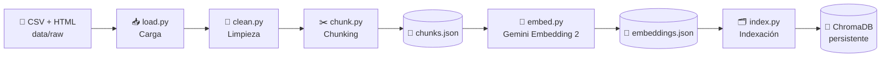
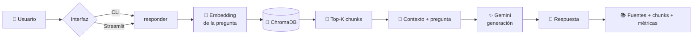
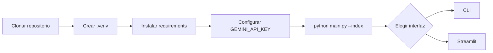
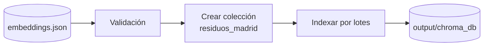
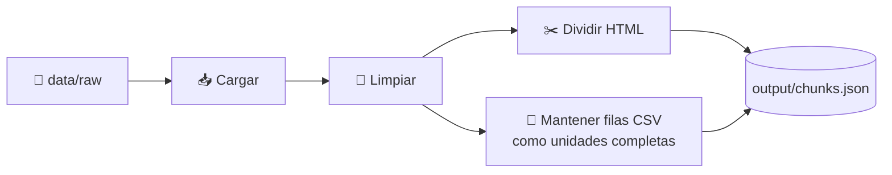
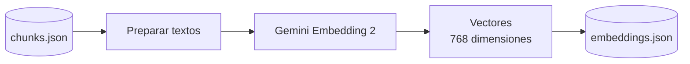
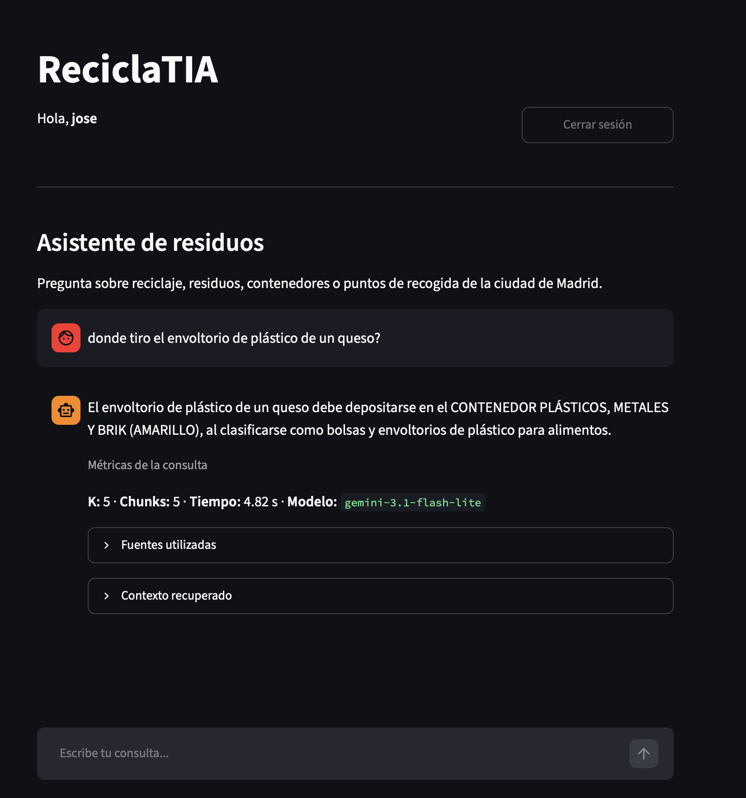

<div align="center">

# ♻️ ReciclaTIA

### Asistente RAG para reciclaje, residuos y puntos de recogida de Madrid

**Python · Gemini · ChromaDB · Streamlit · SQLite**

> Proyecto académico — Project Break 1 · RAG Engineering

</div>

---

## 📌 Índice

- [¿Qué es ReciclaTIA?](#-qué-es-reciclatia)
- [Qué puede hacer](#-qué-puede-hacer)
- [Cómo funciona](#-cómo-funciona)
- [Inicio rápido](#-inicio-rápido)
- [1. Requisitos](#1--requisitos)
- [2. Descargar el proyecto](#2--descargar-el-proyecto)
- [3. Crear el entorno virtual](#3--crear-el-entorno-virtual)
- [4. Instalar dependencias](#4--instalar-dependencias)
- [5. Obtener y configurar la API Key de Gemini](#5--obtener-y-configurar-la-api-key-de-gemini)
- [6. Preparar ChromaDB](#6--preparar-chromadb)
- [7. Usar ReciclaTIA](#7--usar-reciclatia)
- [Regenerar todo el pipeline desde cero](#-regenerar-todo-el-pipeline-desde-cero)
- [CLI](#-uso-por-cli)
- [Streamlit](#-interfaz-streamlit)
- [Configuración técnica](#-configuración-técnica)
- [Corpus y fuentes](#-corpus-y-fuentes)
- [Evaluación](#-evaluación)
- [Logging](#-logging)
- [Estructura del repositorio](#-estructura-del-repositorio)
- [Cuándo hay que regenerar cada artefacto](#-cuándo-hay-que-regenerar-cada-artefacto)
- [Solución de problemas](#-solución-de-problemas)
- [Limitaciones y siguientes pasos](#-limitaciones-y-siguientes-pasos)
- [Equipo](#-equipo)

---

# 🤖 ¿Qué es ReciclaTIA?

**ReciclaTIA** es un asistente basado en **RAG (Retrieval-Augmented Generation)** que responde preguntas sobre gestión de residuos en la **ciudad de Madrid** utilizando un corpus municipal previamente recopilado, limpiado, fragmentado e indexado.

La idea principal es sencilla: antes de generar una respuesta, el sistema **busca información relevante en documentos oficiales** y entrega ese contexto al modelo de lenguaje. De este modo, la respuesta queda anclada al corpus y no depende únicamente del conocimiento general del modelo.

> [!IMPORTANT]
> El generador está instruido para utilizar **únicamente el contexto recuperado**. Si los documentos no contienen información suficiente, debe abstenerse con el mensaje:
>
> **«No puedo responder con la información disponible en los documentos.»**

ReciclaTIA es actualmente una **V1 académica y funcional**. No pretende ser todavía un producto municipal completo ni sustituir la información oficial del Ayuntamiento de Madrid.

---

# ✅ Qué puede hacer

| ReciclaTIA puede | Fuera del alcance actual |
|---|---|
| Indicar en qué contenedor depositar muchos residuos | Calcular automáticamente el contenedor ordinario más cercano |
| Explicar qué residuos admite cada fracción | Trazar rutas mediante GPS o Google Maps |
| Consultar puntos limpios fijos | Responder sobre otras ciudades salvo que estén en el corpus |
| Consultar puntos limpios móviles | Responder preguntas generales no relacionadas con residuos |
| Consultar puntos limpios de proximidad | Sustituir información municipal en tiempo real |
| Informar sobre aceite vegetal usado | Garantizar que una fuente municipal no haya cambiado desde la descarga |
| Informar sobre muebles y enseres | Realizar trámites administrativos |
| Mostrar las fuentes y chunks recuperados | |
| Abstenerse ante preguntas sin evidencia suficiente | |

### 💬 Ejemplos de preguntas

```text
¿Dónde se tira una bombilla?
```

```text
¿Qué residuos van en el contenedor amarillo?
```

```text
¿Dónde puedo tirar el aceite vegetal usado de la cocina?
```

```text
¿Cuál es la dirección del punto limpio fijo de Hortaleza?
```

```text
¿Cómo puedo deshacerme de un colchón o un mueble viejo?
```

También se puede comprobar la abstención con una pregunta fuera del corpus:

```text
¿Qué servicios de reparación de móviles hay cerca de Gran Vía?
```

---

# 🧠 Cómo funciona

## Pipeline offline: preparar el conocimiento



## Pipeline online: responder una pregunta



La API interna que centraliza este flujo es:

```python
responder(pregunta) -> dict
```

Su salida incluye:

```python
{
    "answer": "...",
    "sources": [...],
    "chunks": [...],
    "metrics": {
        "k": 5,
        "num_chunks": 5,
        "time_seconds": 3.21,
        "model": "gemini-3.1-flash-lite"
    }
}
```

---

# 🚀 Inicio rápido

Esta es la ruta recomendada si simplemente quieres **descargar ReciclaTIA y utilizarlo**.

El repositorio ya incluye:

- `output/chunks.json`
- `output/embeddings.json`

Por tanto, **no necesitas volver a generar los chunks ni los 712 embeddings del corpus** para empezar.



> [!TIP]
> Para un primer uso, sigue los pasos **1 a 7**. La sección [Regenerar todo el pipeline desde cero](#-regenerar-todo-el-pipeline-desde-cero) está pensada para desarrolladores o para quien quiera reproducir todas las etapas.

---

# 1 · 📋 Requisitos

Necesitas:

- **Python 3.10 o superior**
- Git
- Conexión a Internet para las llamadas a Gemini
- Una **API Key de Gemini**
- Un navegador web si quieres utilizar Streamlit

Comprueba tu versión de Python:

```bash
python --version
```

En algunos sistemas el comando puede ser:

```bash
python3 --version
```

---

# 2 · 📥 Descargar el proyecto

Desde una terminal:

```bash
git clone https://github.com/alex-bometon/pb-rag-equipo_04.git
cd pb-rag-equipo_04
```

---

# 3 · 🧪 Crear el entorno virtual

Es recomendable instalar las dependencias dentro de un entorno virtual para no modificar el Python global del equipo.

## macOS / Linux

```bash
python -m venv .venv
source .venv/bin/activate
```

## Windows PowerShell

```powershell
py -m venv .venv
.venv\Scripts\Activate.ps1
```

Cuando el entorno está activo normalmente verás algo parecido a esto al inicio de la terminal:

```text
(.venv)
```

---

# 4 · 📦 Instalar dependencias

Actualiza `pip`:

```bash
python -m pip install --upgrade pip
```

Instala el proyecto:

```bash
pip install -r requirements.txt
```

Entre las dependencias principales se encuentran:

- `google-genai`
- `chromadb`
- `streamlit`
- `langchain-text-splitters`
- `beautifulsoup4`
- `pandas`
- `numpy`
- `python-dotenv`
- `bcrypt`

---

# 5 · 🔑 Obtener y configurar la API Key de Gemini

ReciclaTIA utiliza Gemini para:

1. generar el embedding de cada nueva pregunta
2. generar la respuesta final del RAG
3. generar los embeddings del corpus **solo si decides reconstruirlos desde cero**

## 5.1 Crear una clave

1. Entra en **Google AI Studio**:  
   https://aistudio.google.com/
2. Inicia sesión con tu cuenta de Google.
3. Abre el apartado **API Keys**.
4. Crea una nueva clave en un proyecto de Google Cloud disponible.
5. Copia la clave generada.

Documentación oficial de Google:  
https://ai.google.dev/gemini-api/docs/api-key

> [!NOTE]
> Los tipos de clave, cuotas y disponibilidad del nivel gratuito pueden cambiar. Consulta siempre la información mostrada por Google AI Studio para tu cuenta y región.

## 5.2 Crear el archivo `.env`

El repositorio incluye:

```text
.env.example
```

Cópialo como `.env`.

### macOS / Linux

```bash
cp .env.example .env
```

### Windows PowerShell

```powershell
Copy-Item .env.example .env
```

Abre `.env` y sustituye el valor de ejemplo:

```env
GEMINI_API_KEY=tu_clave_real
```

por tu clave:

```env
GEMINI_API_KEY=TU_API_KEY_DE_GEMINI
```

> [!CAUTION]
> **Nunca subas `.env` a GitHub.**  
> La clave es privada. Si modificas el archivo `.gitignore` asegúrate de mantener `.env` dentro para no revelar tus claves públicamente.

---

# 6 · 🗂️ Preparar ChromaDB

Aunque `embeddings.json` está incluido, el índice local de ChromaDB puede regenerarse en cualquier ordenador.

Ejecuta:

```bash
python main.py --index
```

Este comando:



No vuelve a llamar a Gemini para generar los embeddings del corpus.

Una ejecución correcta debe terminar indicando, entre otros datos:

```text
Indexación completada correctamente.
Colección: residuos_madrid
Registros indexados: 712
Dimensiones: 768
Métrica: cosine
```

> [!IMPORTANT]
> Debes ejecutar `--index` antes de hacer consultas si `output/chroma_db/` no existe todavía en tu equipo.

---

# 7 · ▶️ Usar ReciclaTIA

Una vez instalado el proyecto, configurada la API Key e indexado ChromaDB, puedes elegir entre dos formas de uso.

## Opción A — Interfaz web

```bash
streamlit run app.py
```

## Opción B — Terminal

```bash
python main.py --ask "¿Dónde se tira una bombilla?"
```

Las dos interfaces utilizan el mismo núcleo RAG.

---

# 🔄 Regenerar todo el pipeline desde cero

Esta sección explica el proceso completo. **No es necesario hacerlo para el primer uso** porque el repositorio ya contiene los artefactos `chunks.json` y `embeddings.json`.

Úsala si:

- modificas el corpus
- cambias la limpieza
- cambias `CHUNK_SIZE` o `CHUNK_OVERLAP`
- cambias el modelo o dimensionalidad de embeddings
- quieres reproducir todo el trabajo desde las fuentes originales

## Paso 1 — Ingesta, limpieza y chunking

Ejecuta desde la raíz del repositorio:

```bash
python -m src.ingest
```

El módulo realiza automáticamente:



Resultado esperado con el corpus actual:

```text
Archivos originales: 15
Documentos limpios: 691
Chunks generados: 712
```

El archivo generado es:

```text
output/chunks.json
```

### ¿Qué ocurre con cada formato?

**CSV**  
Cada registro ya representa una entidad estructurada —por ejemplo, un punto limpio con dirección, distrito y horario—, así que se conserva como un chunk completo.

**HTML**  
Los documentos largos se dividen con `RecursiveCharacterTextSplitter`.

Configuración actual:

```python
CHUNK_SIZE = 1000
CHUNK_OVERLAP = 100
```

---

## Paso 2 — Generar embeddings del corpus

> [!WARNING]
> Este es el paso que consume cuota de la API de embeddings. Si `output/embeddings.json` ya existe y no has cambiado corpus, chunking o modelo, **no lo ejecutes innecesariamente**.

Ejecuta:

```bash
python -m src.embed
```

Flujo:



Configuración actual:

```python
EMBEDDING_MODEL = "gemini-embedding-2"
EMBEDDING_DIMENSIONS = 768
EMBED_BATCH_SIZE = 50
MAX_CHUNKS_EMBED = None
```

`MAX_CHUNKS_EMBED = None` significa que, al regenerar, se procesan **todos los chunks**.

El código introduce pausas y reintentos para respetar límites temporales de la API. Por ello esta fase puede tardar varios minutos.

Resultado:

```text
output/embeddings.json
```

---

## Paso 3 — Crear el índice vectorial

Cuando `embeddings.json` esté listo:

```bash
python main.py --index
```

Resultado:

```text
output/chroma_db/
```

El índice almacena:

- documento
- embedding
- metadata
- `source`
- identificador determinista del chunk

---

## Paso 4 — Hacer una consulta de retrieval

```bash
python main.py --query "¿Dónde se tira una bombilla?"
```

Este modo recupera contexto, pero **no genera la respuesta final del asistente**.

---

## Paso 5 — Ejecutar el RAG completo

```bash
python main.py --ask "¿Dónde se tira una bombilla?"
```

---

# 💻 Uso por CLI

`main.py` separa claramente indexación, retrieval y RAG completo.

## Ver ayuda

```bash
python main.py --help
```

## Indexar

```bash
python main.py --index
```

## Solo retrieval

```bash
python main.py --query "¿Qué residuos van en el contenedor amarillo?"
```

El terminal muestra los chunks y su fuente.

## Retrieval con otro K

```bash
python main.py --query "¿Qué residuos van en el contenedor amarillo?" --k 3
```

```bash
python main.py --query "¿Qué residuos van en el contenedor amarillo?" --k 10
```

## RAG completo

```bash
python main.py --ask "¿Dónde puedo tirar aceite vegetal usado?"
```

La salida incluye:

- respuesta
- fuentes
- contexto recuperado

## RAG con K personalizado

```bash
python main.py --ask "¿Dónde puedo tirar aceite vegetal usado?" --k 8
```

El valor por defecto es:

```python
TOP_K = 5
```

---

# 🖥️ Interfaz Streamlit

Ejecuta:

```bash
streamlit run app.py
```

Streamlit mostrará en la terminal una dirección local, normalmente:

```text
http://localhost:8501
```

Ábrela en el navegador.

## Primer acceso

La aplicación incluye una pequeña capa de usuarios mediante SQLite.

1. Pulsa **Crear cuenta**
2. Completa los campos obligatorios
3. Inicia sesión
4. Escribe una pregunta en el chat

La base de datos de usuarios se crea localmente en:

```text
webapp/storage/webapp.db
```

Este archivo es local y no debe versionarse.

## Qué muestra una respuesta

La interfaz presenta:

- 💬 respuesta del asistente
- 📊 `K`, número de chunks, tiempo y modelo
- 📚 fuentes utilizadas
- 🧩 contexto recuperado, desplegable chunk a chunk

<p align="center">
  
</p>

---

# ⚙️ Configuración técnica

Los principales parámetros están centralizados en `config.py`.

| Parámetro | Valor actual | Función |
|---|---:|---|
| `CHUNK_SIZE` | `1000` | Tamaño máximo de los chunks textuales |
| `CHUNK_OVERLAP` | `100` | Solapamiento entre chunks HTML |
| `EMBEDDING_MODEL` | `gemini-embedding-2` | Modelo de embeddings |
| `EMBEDDING_DIMENSIONS` | `768` | Dimensión de los vectores |
| `MAX_CHUNKS_EMBED` | `None` | Sin límite: procesa todo el corpus |
| `EMBED_BATCH_SIZE` | `50` | Elementos procesados por lote |
| `CHROMA_COLLECTION_NAME` | `residuos_madrid` | Colección vectorial |
| `CHROMA_DISTANCE` | `cosine` | Métrica de distancia |
| `INDEX_BATCH_SIZE` | `100` | Tamaño máximo configurado para indexación |
| `TOP_K` | `5` | Chunks entregados al RAG |
| `GENERATION_MODEL` | `gemini-3.1-flash-lite` | Modelo generativo |

> [!WARNING]
> Si cambias el modelo de embeddings, sus dimensiones o el contenido que se ha embebido, reconstruye el índice antes de volver a consultar.

---

# 📚 Corpus y fuentes

El corpus final está compuesto por **15 fuentes oficiales** del Ayuntamiento de Madrid:

- **5 CSV** estructurados;
- **10 HTML** de documentación municipal.

Resultado del pipeline actual:

| Elemento | Total |
|---|---:|
| Fuentes originales | 15 |
| Documentos limpios | 691 |
| Chunks | 712 |
| Dimensiones por embedding | 768 |

**Fecha de descarga / consolidación del corpus para esta entrega:** septiembre de 2026.

## Fuentes CSV — Portal de Datos Abiertos del Ayuntamiento de Madrid

| Archivo en el proyecto | Fuente oficial |
|---|---|
| `puntos_limpios_fijos.csv` | [Puntos limpios fijos](https://datos.madrid.es/dataset/200284-0-puntos-limpios-fijos) |
| `puntos_limpios_moviles.csv` | [Puntos limpios móviles](https://datos.madrid.es/dataset/300101-0-puntos-limpios-moviles) |
| `puntos_limpios_moviles_24h.csv` | [Puntos limpios móviles 24 horas](https://datos.madrid.es/dataset/900026-0-puntos-limpios-residuos) |
| `puntos_limpios_proximidad.csv` | [Puntos limpios de proximidad](https://datos.madrid.es/dataset/300198-0-puntos-proximidad) |
| `tipos_residuos.csv` | [Tipos de residuos y dónde depositarlos](https://datos.madrid.es/dataset/300199-0-tipo-residuo) |

Los conjuntos de Datos Abiertos anteriores indican licencia **Creative Commons Attribution 4.0 International (CC BY 4.0)** en sus fichas oficiales.

## Fuentes HTML — Ayuntamiento de Madrid

| Archivo en el proyecto | Página municipal de origen |
|---|---|
| `fraccion_organica.html` | [Recogida de residuos orgánicos](https://www.madrid.es/portales/munimadrid/es/Recogida-de-residuos-organicos/?vgnextchannel=f81379ed268fe410VgnVCM1000000b205a0aRCRD&vgnextoid=12bc51e3f7bee510VgnVCM1000001d4a900aRCRD) |
| `fraccion_papel.html` | [Recogida de la fracción papel y cartón](https://www.madrid.es/portales/munimadrid/es/Inicio/El-Ayuntamiento/Moratalaz/Recogida-de-la-fraccion-papel-y-carton/?vgnextchannel=7cb0ca5d5fb96010VgnVCM100000dc0ca8c0RCRD&vgnextfmt=default&vgnextoid=d9eb6c9c78eb2910VgnVCM2000001f4a900aRCRD) |
| `fraccion_plasticos_metales_briks.html` | [Recogida de plásticos, metales y briks](https://www.madrid.es/portales/munimadrid/es/Recogida-de-plasticos-metales-y-briks-Horarios-y-frecuencias-de-recogida-/?vgnextchannel=3dfcbb21278fe410VgnVCM1000000b205a0aRCRD&vgnextfmt=default&vgnextoid=54c4ebd9be6e8610VgnVCM1000001d4a900aRCRD) |
| `fraccion_resto.html` | [Recogida de la fracción resto no reciclable](https://www.madrid.es/portales/munimadrid/es/Recogida-fraccion-resto-no-reciclable-y-horario/?vgnextchannel=f81379ed268fe410VgnVCM1000000b205a0aRCRD&vgnextoid=61c4ebd9be6e8610VgnVCM1000001d4a900aRCRD) |
| `fraccion_vidrio.html` | [Recogida de vidrio](https://www.madrid.es/portales/munimadrid/es/Recogida-de-vidrio/?vgnextchannel=f81379ed268fe410VgnVCM1000000b205a0aRCRD&vgnextoid=e3ab6c9c78eb2910VgnVCM2000001f4a900aRCRD) |
| `recogida_aceite_vegetal.html` | [Recogida de aceite vegetal usado](https://www.madrid.es/portales/munimadrid/es/Inicio/Medio-ambiente/Recogida-de-residuos/Recogida-de-aceite-vegetal-usado/?vgnextchannel=f81379ed268fe410VgnVCM1000000b205a0aRCRD&vgnextfmt=default&vgnextoid=803fab39d9462510VgnVCM1000000b205a0aRCRD) |
| `recogida_muebles_enseres.html` | [Recogida de muebles, electrodomésticos y enseres](https://www.madrid.es/portales/munimadrid/es/Inicio/MedioAmbiente/ResiduosYLimpiezaUrbana/Tramites/Recogida-de-muebles-electrodomesticos-y-enseres/?vgnextchannel=e5bcbb21278fe410VgnVCM1000000b205a0aRCRD&vgnextfmt=default&vgnextoid=168e3381d0030910VgnVCM1000001d4a900aRCRD) |
| `residuos_punto_limpio_fijo.html` | [Puntos Limpios Fijos: cantidades admisibles](https://www.madrid.es/portales/munimadrid/es/UnidadWeb/Puntos-Limpios-Fijos-del-Ayuntamiento-de-Madrid-Descripcion-y-cantidades-admisibles-para-particulares/?vgnextchannel=e278e8124824b010VgnVCM1000000b205a0aRCRD&vgnextoid=cc9a2984ca480510VgnVCM2000000c205a0aRCRD) |
| `residuos_punto_limpio_movil.html` | [Puntos Limpios Móviles: cantidades admisibles](https://sede.madrid.es/portal/site/tramites/menuitem.1f3361415fda829be152e15284f1a5a0/?vgnextchannel=518aa38813180210VgnVCM100000c90da8c0RCRD&vgnextfmt=pda&vgnextoid=3cbc6163c4480510VgnVCM2000000c205a0aRCRD) |
| `residuos_punto_limpio_proximidad.html` | [Puntos Limpios de Proximidad: cantidades admisibles](https://www.madrid.es/portales/munimadrid/es/Inicio/Medio-ambiente/Gestiones-y-tramites/Puntos-Limpios-de-Proximidad-Descripcion-y-cantidades-admisibles-/?vgnextchannel=658f79ed268fe410VgnVCM1000000b205a0aRCRD&vgnextfmt=default&vgnextoid=2682a2dcf3189610VgnVCM1000001d4a900aRCRD) |

### Uso de los datos

Este proyecto tiene **finalidad educativa**.

El corpus procede de información pública municipal. No se incluyen en el corpus claves privadas, contraseñas ni otros secretos. Las credenciales necesarias para Gemini se mantienen exclusivamente en el archivo local `.env`.

---

# 📊 Evaluación

La evaluación se realiza en dos capas, tal como requiere el proyecto:

1. **retrieval**;
2. **generación end-to-end**.

El dataset canónico se encuentra en:

```text
queries/eval_queries.json
```

Contiene:

```text
14 preguntas
├── 11 respondibles con el corpus
└── 3 fuera de dominio (OOD)
```

## Experimento de chunking

| Configuración | `CHUNK_SIZE` | `CHUNK_OVERLAP` | Chunks |
|---|---:|---:|---:|
| A | 800 | 100 | 722 |
| **B — seleccionada** | **1000** | **100** | **712** |
| C | 1500 | 150 | 704 |

Se mantiene `1000 / 100` como equilibrio entre granularidad y conservación del contexto.

## Evaluación de retrieval

Se reutilizan embeddings persistidos de las preguntas de evaluación para no consumir nuevamente la API.

| K | Fuentes esperadas recuperadas | Tasa |
|---:|---:|---:|
| 3 | 8/11 | 72,7 % |
| **5** | **9/11** | **81,8 %** |
| 8 | 9/11 | 81,8 % |
| 10 | 9/11 | 81,8 % |

Se selecciona **K = 5** porque aumentar el número de chunks no mejora el acierto observado y sí puede añadir ruido y tokens al prompt.

## Evaluación RAG end-to-end

Con `K = 5`:

| Métrica | Resultado |
|---|---:|
| Preguntas totales | 14 |
| Errores de ejecución | 0 |
| Preguntas respondibles | 11 |
| Fuente esperada recuperada | 9/11 |
| Respondidas sin abstención | 9/11 |
| Preguntas OOD | 3 |
| Abstenciones correctas OOD | **3/3** |

### Ejecutar retrieval test

```bash
python tests/retrieval/retrieve_test.py
```

### Ejecutar evaluación end-to-end

> Esta prueba llama al modelo generativo y, por tanto, consume cuota de Gemini.

```bash
python tests/evaluation/evaluate_test.py
```

Los resultados finales se conservan en:

```text
tests/retrieval/results.txt
tests/evaluation/results_k5.json
```

Para regenerar únicamente los embeddings de las preguntas de evaluación:

```bash
python tests/query_embeddings.py
```

No es necesario ejecutar este último comando si la caché actual sigue siendo válida.

El análisis completo de las decisiones, experimentos y fallos conocidos se encuentra en:

```text
entregables/informe_decisiones_final.md
```

---

# 📝 Logging

Cada consulta RAG registra información básica en formato JSONL:

```text
output/logs/rag.jsonl
```

Ejemplo:

```json
{
  "timestamp": "2026-09-20T10:00:00+00:00",
  "question": "¿Dónde tiro una botella de vidrio?",
  "k": 5,
  "num_chunks": 5,
  "time_seconds": 2.814,
  "model": "gemini-3.1-flash-lite"
}
```

Estos logs son locales y no contienen la API Key.

---

# 🗃️ Estructura del repositorio

```text
pb-rag-equipo_04/
├── app.py                         # Interfaz Streamlit
├── main.py                        # CLI
├── config.py                      # Configuración central
├── requirements.txt
├── .env.example
│
├── data/
│   └── raw/
│       ├── csv/                   # Fuentes estructuradas
│       ├── html/                  # Documentación municipal
│       ├── pdf/                   # Vacía con .gitkeep. Se mantiene por ser habitual este tipo de archivo.
│       └── txt/                   # Vacía con .gitkeep. Se mantiene por ser habitual este tipo de archivo.
│
├── src/
│   ├── load.py                    # Carga
│   ├── clean.py                   # Limpieza
│   ├── chunk.py                   # Chunking
│   ├── ingest.py                  # Orquestación load → clean → chunks
│   ├── embed.py                   # Embeddings del corpus
│   ├── artifacts.py               # Persistencia de artefactos
│   ├── index.py                   # ChromaDB
│   ├── retrieve.py                # Retrieval
│   ├── generate.py                # Generación y abstención
│   ├── rag.py                     # API interna responder()
│   ├── gemini_client.py           # Cliente Gemini
│   └── logging_utils.py           # Logs
│
├── webapp/
│   ├── assistant_service.py       # Puente Streamlit ↔ RAG
│   ├── auth.py                    # Registro y autenticación
│   ├── database.py                # SQLite
│   ├── validators.py              # Validaciones
│   ├── config_app.py
│   └── storage/                   # Datos locales de la webapp
│
├── output/
│   ├── chunks.json                # Chunks persistidos
│   ├── embeddings.json            # Embeddings persistidos
│   ├── cache/                     # Caché de evaluación
│   ├── chroma_db/                 # Índice local regenerable
│   └── logs/                      # Logging local
│
├── queries/
│   └── eval_queries.json          # Dataset de evaluación
│
├── tests/
│   ├── chunks/
│   ├── embeddings/
│   ├── index/
│   ├── retrieval/
│   ├── generation/
│   └── evaluation/
│
├── docs/                           # Decisiones y documentación técnica
└── entregables/
    └── informe_decisiones_final.md
```

---

# 🔧 Cuándo hay que regenerar cada artefacto

No todos los cambios obligan a rehacer todo el pipeline.

| Has cambiado… | Ingesta / chunks | Embeddings | Índice |
|---|:---:|:---:|:---:|
| Solo `TOP_K` | ❌ | ❌ | ❌ |
| Solo el prompt o modelo generativo | ❌ | ❌ | ❌ |
| `CHUNK_SIZE` / `CHUNK_OVERLAP` | ✅ | ✅ | ✅ |
| Limpieza del corpus | ✅ | ✅ | ✅ |
| Archivos de `data/raw/` | ✅ | ✅ | ✅ |
| Modelo de embeddings | ❌* | ✅ | ✅ |
| Dimensiones de embeddings | ❌* | ✅ | ✅ |
| Se ha borrado `output/chroma_db/` | ❌ | ❌ | ✅ |

`*` Si los chunks siguen siendo exactamente los mismos, `chunks.json` puede reutilizarse.

### Regeneración completa

```bash
python -m src.ingest
python -m src.embed
python main.py --index
```

### Solo reconstruir ChromaDB

```bash
python main.py --index
```

---

# 🧯 Solución de problemas

## `ModuleNotFoundError`

Comprueba que el entorno virtual está activo y reinstala dependencias:

```bash
pip install -r requirements.txt
```

Ejecuta los módulos desde la **raíz del proyecto**.

---

## No encuentra `GEMINI_API_KEY`

Comprueba que existe:

```text
.env
```

con:

```env
GEMINI_API_KEY=TU_CLAVE
```

No utilices únicamente `.env.example`: ese archivo es una plantilla.

---

## ChromaDB no encuentra la colección

Si aparece un error indicando que no existe `residuos_madrid`, reconstruye el índice:

```bash
python main.py --index
```

---

## Error `429` de Gemini

Significa normalmente que se ha alcanzado algún límite temporal o de cuota del proveedor.

- Espera antes de repetir la operación.
- Revisa los límites de tu proyecto en Google AI Studio / Google Cloud.
- Evita regenerar `embeddings.json` si ya existe y el corpus no ha cambiado.

---

## Streamlit no arranca

Comprueba primero:

```bash
streamlit --version
```

Después:

```bash
streamlit run app.py
```

Si `streamlit` no existe en el entorno:

```bash
pip install -r requirements.txt
```

---

## He cambiado los documentos y las respuestas siguen usando información antigua

Debes regenerar el pipeline:

```bash
python -m src.ingest
python -m src.embed
python main.py --index
```

---

# ⚠️ Limitaciones y siguientes pasos

Esta versión demuestra el flujo RAG completo, pero todavía existen casos mejorables.

### 1. Tipos de puntos limpios muy parecidos

Consultas sobre **punto limpio fijo**, **móvil** y **de proximidad** pueden recuperar documentos semánticamente muy similares.

Una futura versión podría utilizar filtros de metadata por tipo de instalación.

### 2. Preguntas muy generales sobre datasets estructurados

Una consulta agregada como:

```text
¿Qué tipos de residuos reconoce el Ayuntamiento de Madrid?
```

puede no recuperar `tipos_residuos.csv` entre los primeros resultados.

Se podrían añadir chunks resumen o estrategias específicas para datos tabulares.

### 3. Retrieval correcto pero abstención del generador

En alguna pregunta de evaluación el retrieval recupera la fuente correcta, pero el modelo considera que el contexto no es suficiente.

Una futura iteración puede estudiar el prompt, la limpieza de esos documentos o una etapa de evaluación de relevancia previa a generación.

### Evolución prevista

La arquitectura deja abierta la incorporación posterior de:

- geolocalización
- cálculo del punto de recogida más cercano
- rutas
- filtros por metadata
- reranking
- mayor cobertura municipal
- despliegue web
- monitorización y MLOps

---

# 🔐 Seguridad y privacidad

- `.env` debe permanecer fuera de Git.
- La API Key no debe aparecer en código, notebooks, capturas ni logs.
- `webapp/storage/webapp.db` es una base de datos local y no debe versionarse.
- `output/logs/*.jsonl` contiene consultas realizadas localmente y debe tratarse como información de ejecución.
- Antes de publicar un fork, revisa siempre `git status` y `.gitignore`.

---

# 🌿 Git y reproducibilidad

El proyecto se ha desarrollado mediante ramas de trabajo e integración mediante Git.

La rama estable de entrega debe permitir, desde un entorno limpio:

```bash
pip install -r requirements.txt
cp .env.example .env
# configurar GEMINI_API_KEY
python main.py --index
python main.py --ask "¿Dónde se tira una bombilla?"
streamlit run app.py
```

sin depender del entorno local de ningún miembro del equipo.

---

# 👥 Equipo

| Miembro | Áreas principales de trabajo |
|---|---|
| **Alex Bometón** | Corpus, ingesta/chunking, embeddings, integración, revisión final y Streamlit |
| **Pol Castelló** | Retrieval y experimentación de recuperación |
| **Mihaela Andrea** | Generación y evaluación |

Las distintas ramas fueron posteriormente integradas y revisadas para hacer que corpus, retrieval, generación, CLI, evaluación y Streamlit compartan un único flujo RAG.

---

# 📄 Documentación adicional

Para profundizar en las decisiones técnicas:

```text
docs/decision_corpus_V1.md
docs/decision_embeddings_v1.md
docs/decision_retrieval_v1.md
entregables/informe_decisiones_final.md
```

El **informe de decisiones final** contiene el estado consolidado de los experimentos de chunking, retrieval, generación, evaluación, fallos conocidos y siguientes pasos.

---

<div align="center">

### ♻️ ReciclaTIA

**Buscar primero. Responder después. No inventar cuando el corpus no sabe.**

Proyecto académico desarrollado con datos públicos del Ayuntamiento de Madrid.

</div>
